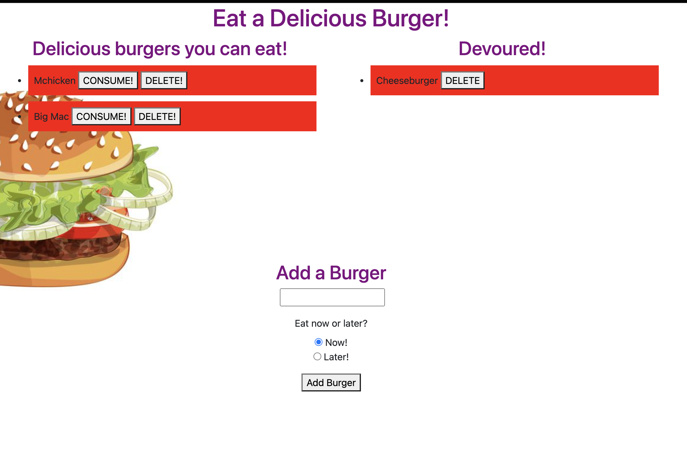

# deliciousBurger

  ## Table of Contents

  - [Application Links](#links)

  - [Screenshots](#screenshots)

  - [Acknowledgments](#acknowledgments)

  ## Description

  >This is an application that I created that is used to experiment with ORM, Node.js, handlebars, MySQL and deploying Heroku with a backend database. Your on the home page you see two options devoured
  ## Links

  >Repository: https://github.com/elhiloyasin/deliciousBurger

  Deployed application:

  ## Screenshots

  ;
  

  ## Contact Me
  Visit my Github profile at https://github.com/elhiloyasin/deliciousBurger.

 Email: elhiloyasin@gmail.com

  ## Acknowledgments

  > Thanks to __Johnnie Simpson__ for assisting me in completing this Homework. It was a very challenging homework. I truely want to credit him for his assitance. Here is _Johnnie Simpson_ github. 

  > Check out __Johnnie Simpson__ Github profile at http://www.github.com/balokdecoy.

